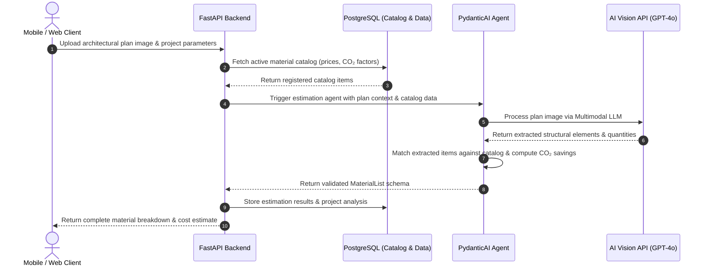

# EcoBuild AI API

> **This project was developed as part of NextStep Hacks 2026.**

---

## Overview

**EcoBuild AI API** is a backend service designed to streamline engineering workflows and drive sustainable construction management. By leveraging autonomous **AI Agents**, the system evaluates architectural floor plan images to generate automated material estimates, cost projections, and carbon footprint assessments.

The primary goal is to empower civil engineers, project managers, and builders to make data-driven, eco-friendly decisions early in the design phase—minimizing material waste, reducing overall costs, and mitigating environmental impact.

---

## Problem Statement & Impact

Traditional estimation and structural planning in construction often suffer from manual inaccuracies, leading to severe economic and environmental consequences:

* **High Carbon Footprint:** Inefficient material allocation increases embodied carbon emissions in building projects.
* **Costly Overruns & Delays:** Poor initial planning and inaccurate quantity takeoffs result in project bottlenecks and budget inflations.
* **Excessive Waste Generation:** Miscalculated raw material demands directly contribute to landfill accumulation.

EcoBuild AI addresses these challenges by automating floor plan analysis through AI agents that match extracted structural needs against real-time market data and eco-friendly standards.

---

## Key Features

* **Organization Management:** Multi-tenant structure allowing teams to create and manage engineering organizations.
* **Project & Plan Scaffolding:** Create, attach, and track multiple architectural plans under a single organization.
* **AI-Powered Floor Plan Analysis:** Automated computer vision and LLM extraction agents analyze uploaded floor plan images to compute required material quantities.
* **Custom Catalog & Pricing Management:** Allows administrators to seed and manage local construction materials, including current market prices and carbon emission metrics ($CO_2$ factors).
* **Automated Cost & CO₂ Estimation:** Cross-references plan estimates with the active catalog to generate accurate, deterministic total cost summaries and environmental impact metrics.

---

## Live Demo / Base URL

The API is fully deployed and available for testing at:

**[https://ecobuild-ai.onrender.com/](https://ecobuild-ai.onrender.com/)**

> You can inspect endpoints and interact directly with the live service via the Swagger UI at [`https://ecobuild-ai.onrender.com/docs`](https://ecobuild-ai.onrender.com/docs).

---

## Tech Stack

* **Backend Framework:** FastAPI (Asynchronous Python)
* **Database & Migration:** PostgreSQL, SQLAlchemy 2.0 (Async Engine), Alembic
* **AI & Agent Orchestration:** PydanticAI, OpenAI (GPT-4o / Vision models)
* **Package Management:** `uv` / `pip`
* **Cloud Infrastructure:** Render

---

## 📐 Architecture & Workflow

The diagram below illustrates how requests flow through the FastAPI backend, PydanticAI vision agents, external AI vision services, and the PostgreSQL database:

---

## Future Roadmap

* [ ] **Context-Aware Interactive Chat:** Allow users to converse with AI agents to refine architectural constraints and custom specifications.
* [ ] **Post-Analysis Discussion Agent:** Dedicated conversational assistant to discuss, critique, and optimize generated material reports.
* [ ] **Retrieval-Augmented Generation (RAG):** Enable agents to evaluate past project analyses and historical data before generating new estimates.
* [ ] **Asynchronous Task Notifications:** Implement background workers (Celery/Redis or Webhooks) to notify users via email/push when long-running visual plan analyses are ready.
* [ ] **Enhanced Route Security:** Implement granular RBAC (Role-Based Access Control) and OAuth2/JWT authentication across all organization endpoints.

